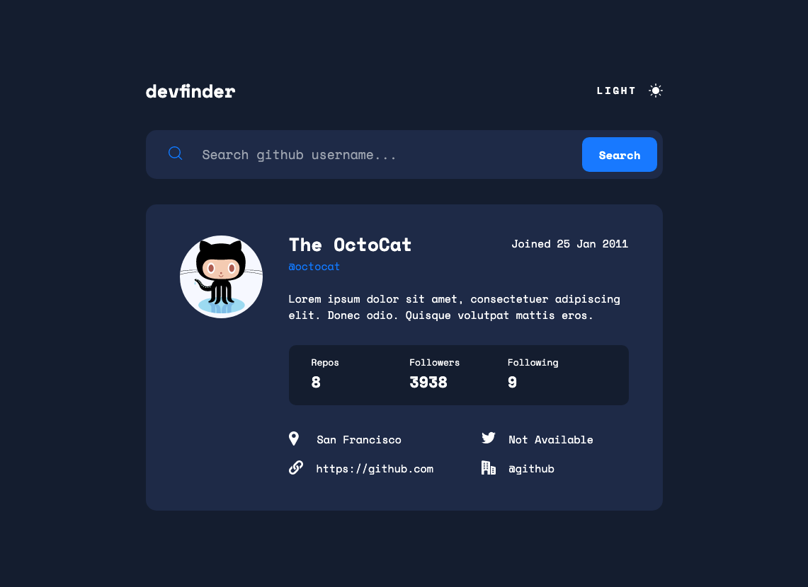

# Frontend Mentor - GitHub user search app solution

This is a solution to the [GitHub user search app challenge on Frontend Mentor](https://www.frontendmentor.io/challenges/github-user-search-app-Q09YOgaH6). Frontend Mentor challenges help you improve your coding skills by building realistic projects.

## Installation and Setup Instructions 💻

Clone down this repository. You will need `node` and `npm` installed globally on your machine.

Installation:

`npm install`

To Start Server:

`npm start`

To Visit App:

`localhost:3000`

## Table of contents 📄

- [Frontend Mentor - GitHub user search app solution](#frontend-mentor---github-user-search-app-solution)
  - [Installation](#installation-and-setup-instructions)
  - [Table of contents](#table-of-contents)
  - [Overview](#overview)
    - [The challenge](#the-challenge)
    - [Screenshot](#screenshot)
    - [Links](#links)
  - [My process](#my-process)
    - [Built with](#built-with)
  - [Author](#author)

## Overview 🧩

### The challenge

Users should be able to:

- View the optimal layout for the app depending on their device's screen size
- See hover states for all interactive elements on the page
- Search for GitHub users by their username
- See relevant user information based on their search
- Switch between light and dark themes
- **Bonus**: Have the correct color scheme chosen for them based on their computer preferences. _Hint_: Research `prefers-color-scheme` in CSS.

### Screenshot

### Links 🔗

- Solution URL: [https://github.com/EslimDaga/react-github-user-search](https://github.com/EslimDaga/react-github-user-search)
- Live Site URL: [https://react-user-github-search-app.netlify.app/](https://react-user-github-search-app.netlify.app/)

## My process 📄

### Built with

- [React](https://reactjs.org/) - JS library
- [Tailwind ](https://tailwindcss.com/) - CSS framework

## Author 👨🏻‍💻

- Frontend Mentor - [@eslimdaga](https://www.frontendmentor.io/profile/eslimdaga)
- Twitter - [@eslimdaga](https://www.twitter.com/eslimdaga)